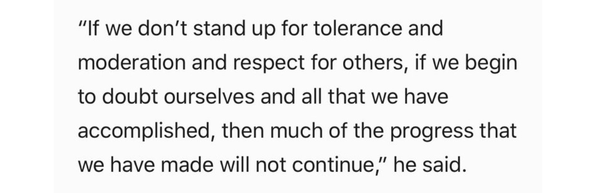
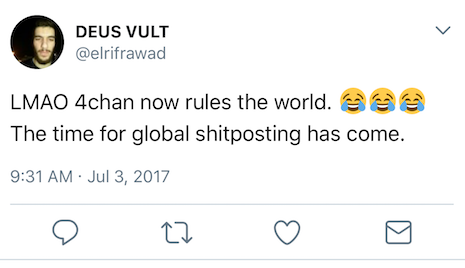

# FIFTH BY MIDWEST

*Interested in getting involved?* Check out the [CONTRIBUTING](CONTRIBUTING.md) doc and dive in to the [issues](https://github.com/fifthbymidwest/fifthbymidwest.github.io/issues)

We aim to reduce online conflict and raise citizen engagement by employing empathy, providing education, and refusing to give the internet to those who would corrupt her best features.

It will be challenging, but we have many resources. We have technology. We have psychology. We have data processing capabilities never before seen by humans. Let's use our tools and put them to good use.

This is a project with a large scale and will need help from many people with diverse talents.

> 
> President Barack Obama

[Read the tweetstorm](https://twitter.com/jannypie/status/826937808954806277)

## The problem

- Hate groups and spread of misinformation online (intentional or not) have had an out-sized effect relative to representation in the population, up to affecting the outcome of the 2016 Presidential election, but also negatively impacting the experience of individuals online through harassment and fear

- Internet was invented to connect people and research, and expanded to allow collaboration and sharing across the Earth
  - Technology has advanced such that the collection, storage, and analysis of large amounts of data is more simple than ever
  - This type of data analysis has been used by "Black Hat" sources (including political campaigns and foreign governments) to influence public opinion online, to gerrymander voting districts, and to suppress voting populations

- Technology and connectedness will continue to pervade our daily lives
  - Traditional advice to "Get off the internet" ignores this reality
  - People are unlikely to get offline any time soon
  - Black Hat groups will not be getting offline any time soon either, and leaving the capabilities of the internet in their hands is not only unrealistic, but dangerous

> 

- We need tools and people to fight this
  - Make discourse more productive based on principles of effective debate, persuasion, and empathy
  - Connect with individuals and spread trusted information to those lacking education or who have been exposed to misinformation

## The approach

- Teach people how to communicate online with empathy
- Teach people "internet smarts"
- Create a centralized resource for reference materials (CMS)
- Use technology tools to analyze and determine which approaches have greater success
  - Sentiment analysis
  - Alex suggestion tool
- Use tech tools to connect people with voting tools and contact information for their representatives

## The Needs

- Core App that people can sign up for
  - Automatically match users with representative information, local political action groups, voting schedule and issues
  - Articles and other content publishing
- Content Management System
- Reference ID System
- Social media integration
- Content production
- Graphics production
